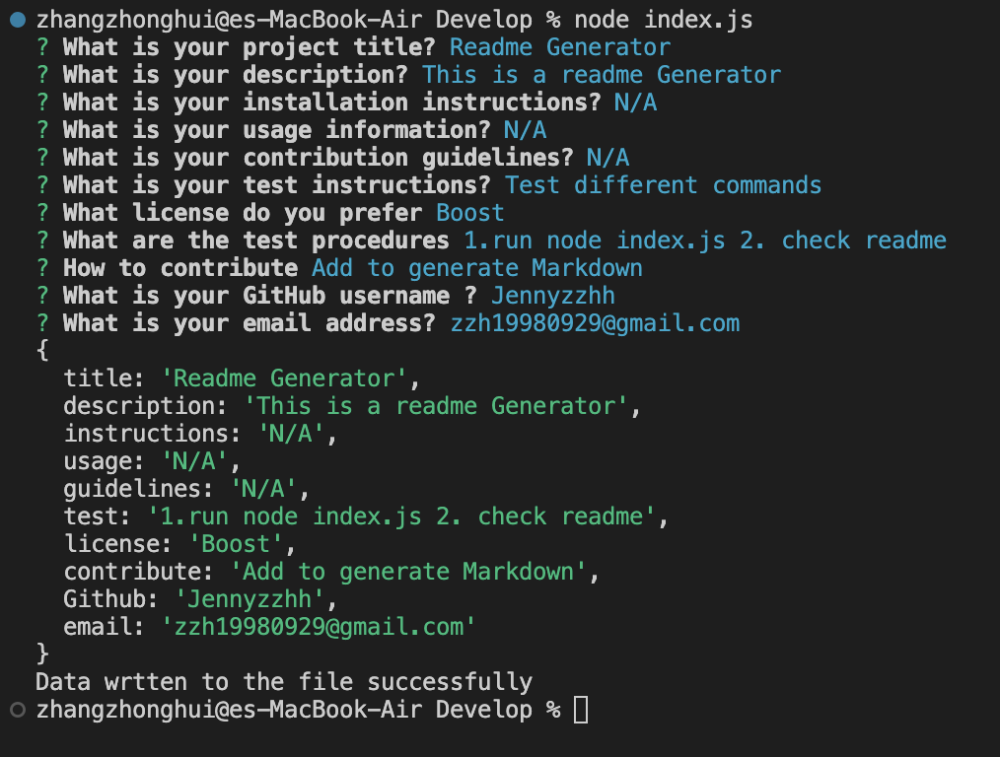

# Professional README Generator Starter Code

## Description

- This project enables the audience to generate README by using this command line application. This allows the project creator to devote more time working on the project.

## Usage

- This project dynamically generates a professional README.md file from the user's input. User just need to simply answer the prompted questions. 

## Images

## Video 

## deployed application

[application link] (https://jennyzzhh.github.io/Module6-Weather-Dashboard/)

[Github link] (https://github.com/Jennyzzhh/Module6-Weather-Dashboard.git)
